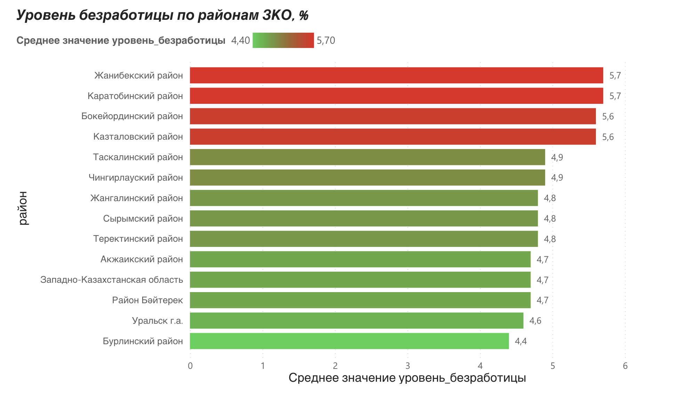

# Анализ банкротств юрлиц по ЗКО

Учебный проект по анализу данных: сбор, очистка и визуализация 
списка компаний-банкротов Западно-Казахстанской области.

## Источник данных
- Комитет госдоходов МФ РК (kgd.gov.kz) — список компаний-банкротов
- Бюро нацстатистики РК (stat.gov.kz) — уровень безработицы по районам ЗКО

## Что сделано
- Загрузка и очистка сырого Excel (БИН, дубли, даты, названия)
- Feature engineering: создание признака "форма компании"
- Визуализация: 3 графика (matplotlib)

## Ключевые находки
**Выводы:**
1. Один руководитель нередко связан сразу с несколькими компаниями-банкротами 
(в топе — до 8 компаний на одно лицо). Это сигнал, требующий проверки: 
возможны номинальные директора или преднамеренные банкротства.
2. Среди банкротов преобладают ТОО — 41 из 56 компаний.
3. Качество госданных низкое: дата решения суда указана лишь у 23 из 56 записей (41%), 
встречались дубли и пустые БИН. Поэтому анализ динамики по годам носит 
иллюстративный характер.
4. Уровень безработицы по районам ЗКО довольно ровный — от 4,4% до 5,7%, 
резких выбросов нет. Выше всего в Жанибекском и Каратобинском районах, 
ниже всего в Бурлинском.

## Файлы
- `sqlnalog.ipynb` — SQL-анализ (SQLite)
- `unemployment_zko_clean.csv` — данные по безработице
- `powerbi_dashboard.png` — дашборд в Power BI

## Стек
Python, pandas, matplotlib, SQL (SQLite), Power BI, Google Colab

## Power BI дашборд

Интерактивный дашборд «Уровень безработицы по районам ЗКО», 
построенный в Power BI на очищенных данных статистики.

